<p align="center">
  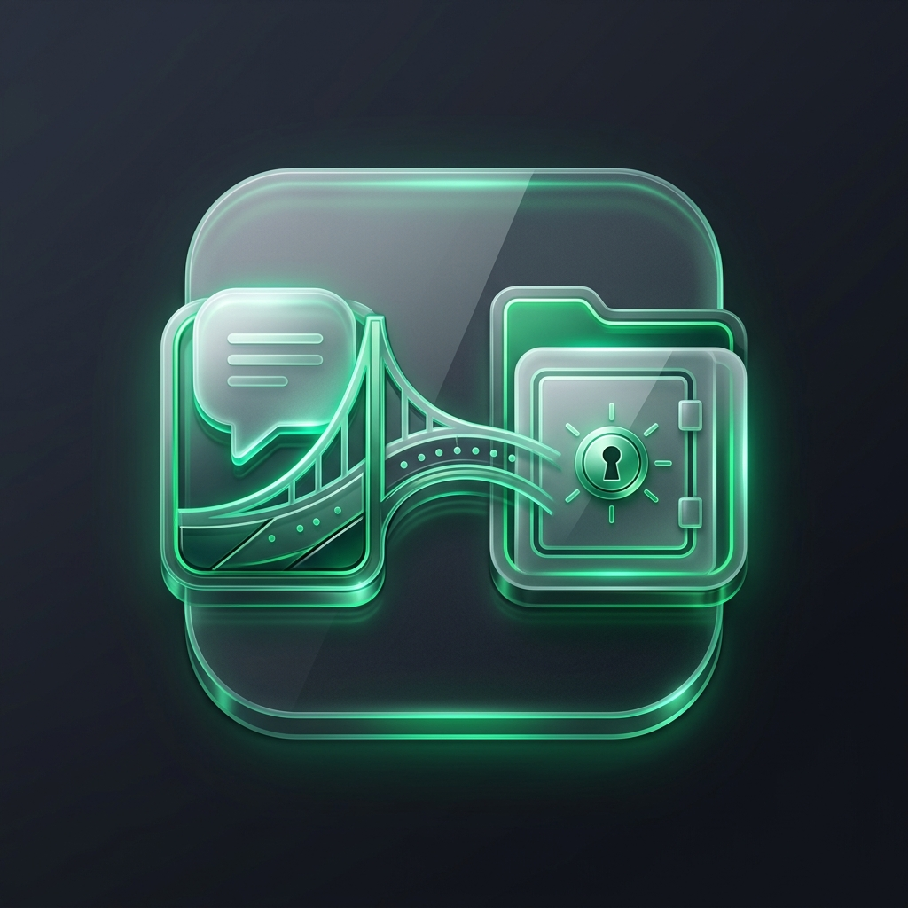
</p>

<h1 align="center">LedgerLink</h1>

<p align="center">
  <strong>Archive WhatsApp &amp; Telegram chats into structured Obsidian vaults</strong><br/>
  Built for accountants, administrators, and anyone who needs searchable, local-first message archives.
</p>

<p align="center">
  <a href="https://github.com/mohammednabarawy/ledgerlink/releases/latest">
    
  </a>
  
  
  <a href="LICENSE">
    
  </a>
</p>

---

## Overview

LedgerLink is a desktop app that connects to **WhatsApp Web** and **Telegram**, lets you pick an **Obsidian vault**, and archives chats into clean monthly Markdown with linked media. It supports multiple local accounts, background watching, OCR, PDF scanning, and local voice/video transcription.

<p align="center">
  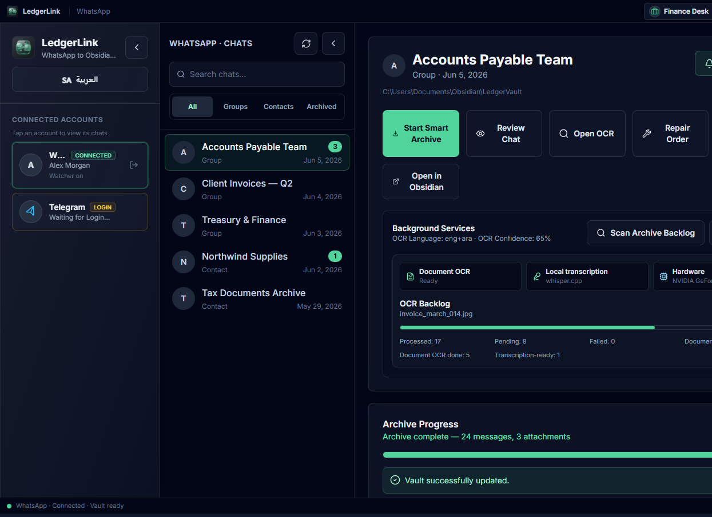
  <br/>
  <em>Connected workspace with fictional demo data (see note below)</em>
</p>

---

## Features

| Feature | Description |
|--------|-------------|
| **Dual platforms** | WhatsApp and Telegram in one desktop shell |
| **Obsidian export** | Monthly Markdown archives with attachments in vault folders |
| **Multi-account profiles** | Separate vaults, OCR defaults, and sessions per profile |
| **Auto-archive watcher** | Debounced background sync for new, edited, and revoked messages |
| **OCR** | Image and PDF text extraction (Tesseract) with English + Arabic |
| **Transcription** | Local whisper.cpp + ffmpeg for voice notes and video |
| **Bilingual UI** | English (LTR) and Arabic (RTL) with mirrored layout |
| **Privacy-first** | Sessions and API keys stay on your machine — never bundled in releases |

---

## Screenshots

> **Privacy note:** README images use either a logged-out app state or **simulated demo data** (fictional names like *Alex Morgan*, *Accounts Payable Team*, placeholder API keys). No real chats, phone numbers, or credentials are shown.

### Getting started (before login)

| | |
|:---:|:---:|
| 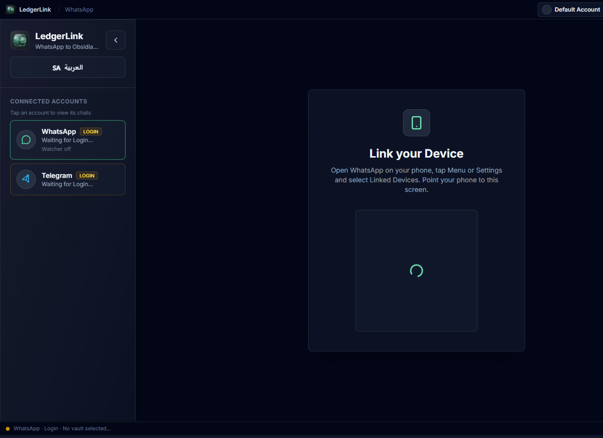<br/><sub>Link WhatsApp via QR</sub> | 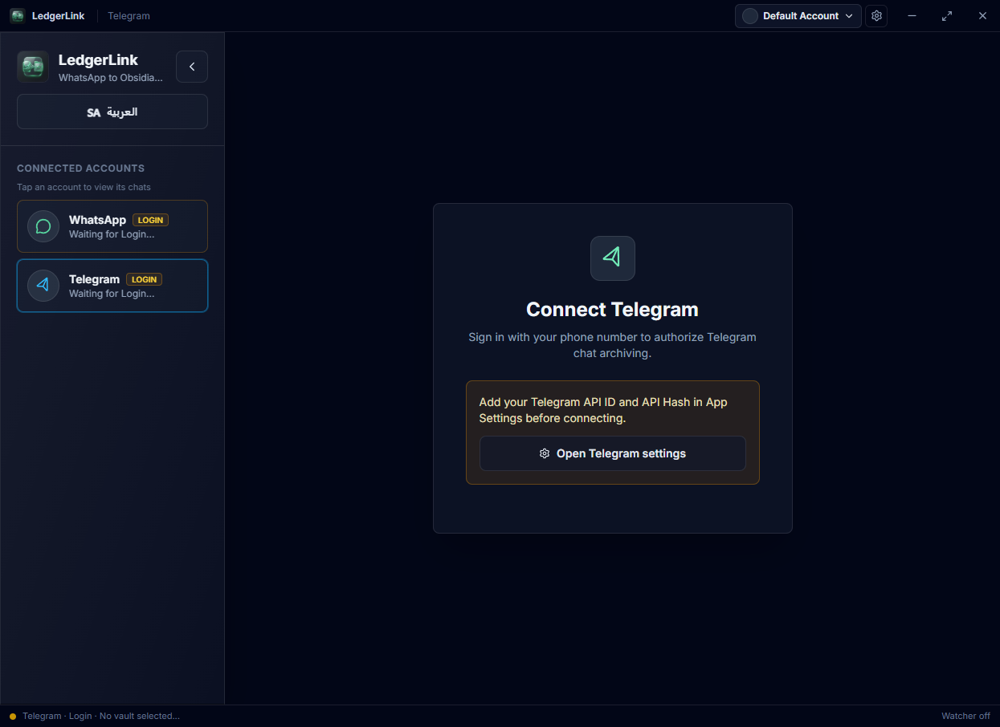<br/><sub>Telegram — add API keys first</sub> |
| 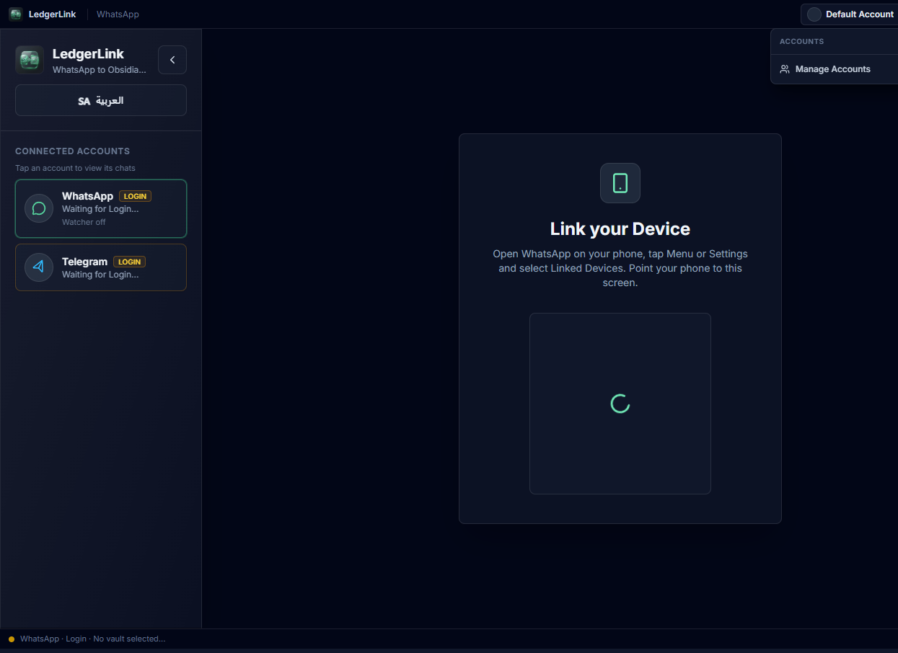<br/><sub>Switch profiles from the title bar</sub> | 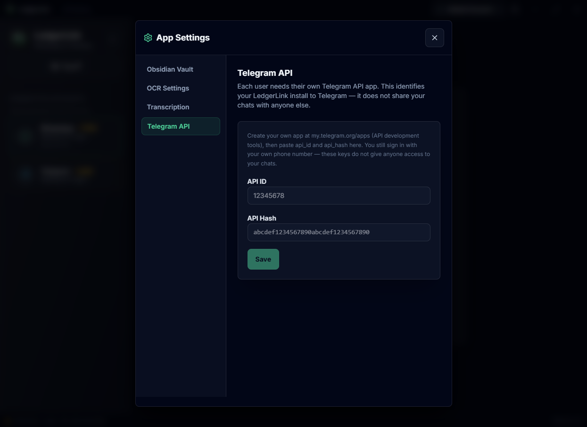<br/><sub>App Settings → Telegram API</sub> |

### Connected workspace

Archive a chat, enable the watcher, and monitor OCR backlog — all from one panel.

<p align="center">
  
</p>

<p align="center">
  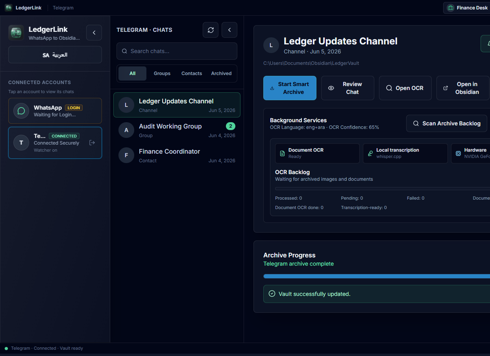
</p>

### Archive in progress

<p align="center">
  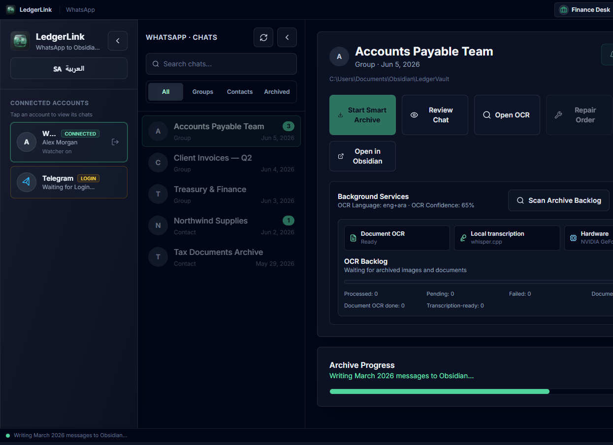
</p>

### Chat review &amp; OCR

Open the original message stream and extract text from receipt images.

<p align="center">
  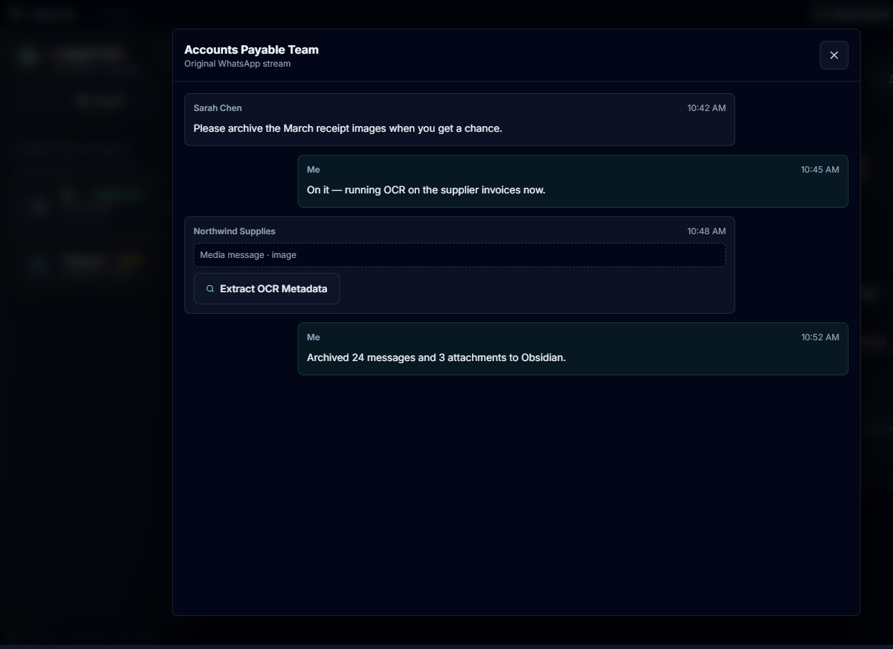
</p>

### App Settings

| | |
|:---:|:---:|
| 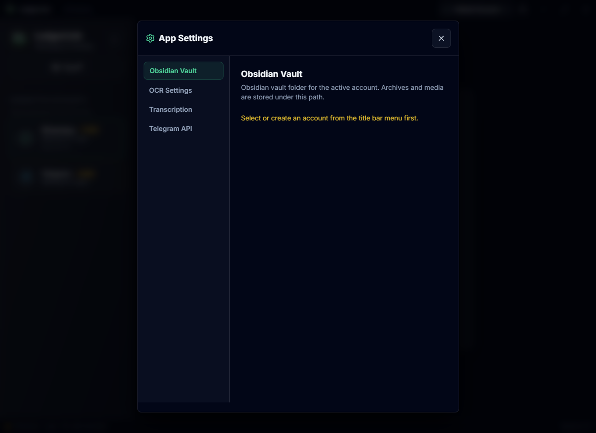<br/><sub>Obsidian vault path</sub> | 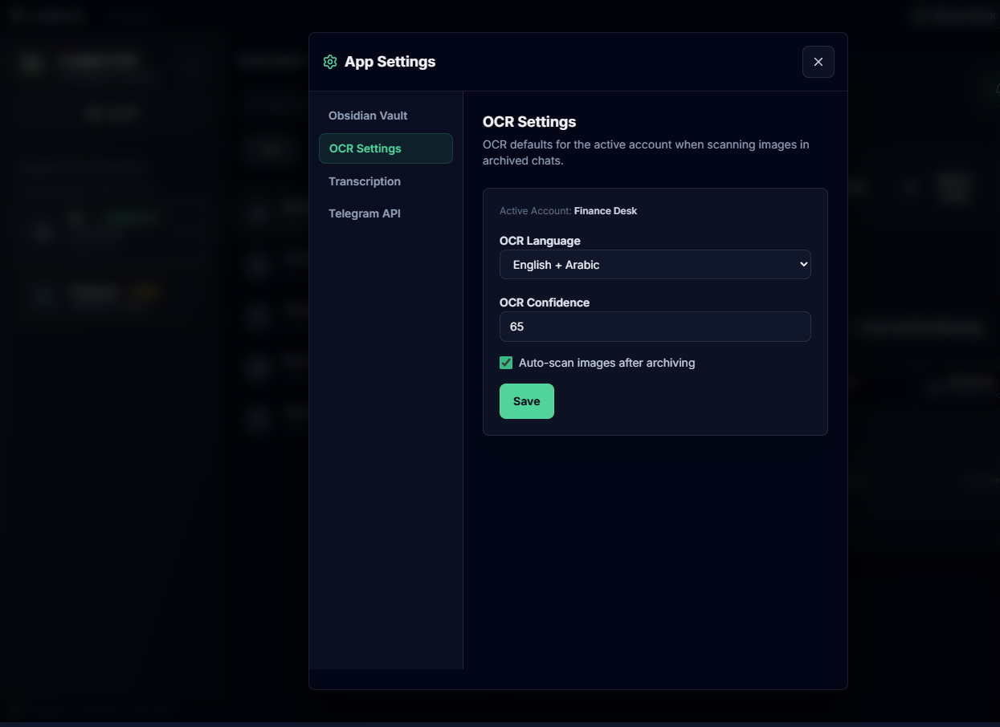<br/><sub>OCR language &amp; confidence</sub> |
| 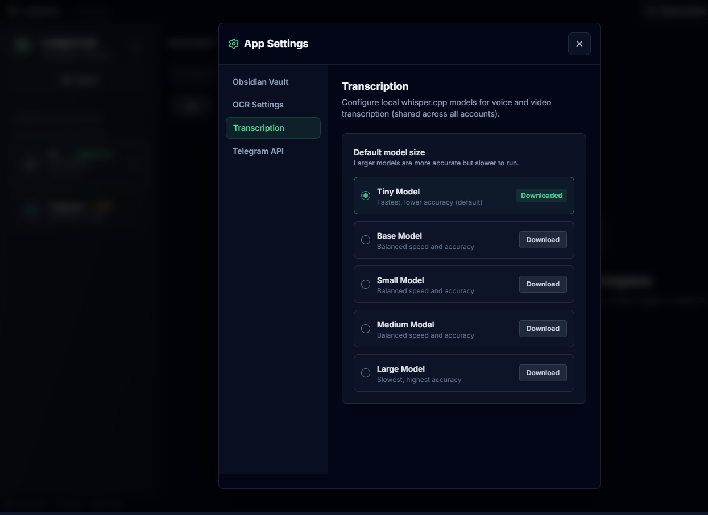<br/><sub>Transcription models</sub> | |

---

## Download

**Windows x64 (installer):** [Latest release](https://github.com/mohammednabarawy/ledgerlink/releases/latest)

```
LedgerLink-1.0.0-Windows-x64-Setup.exe
```

> The installer is unsigned. Windows SmartScreen may show a warning on first run — choose *More info → Run anyway* if you trust the source.

---

## Getting started

1. **Install** LedgerLink from the [releases page](https://github.com/mohammednabarawy/ledgerlink/releases/latest).
2. **App Settings → Obsidian Vault** — choose the vault folder for your active account.
3. **App Settings → Telegram** — add your own [API ID and API Hash](https://my.telegram.org/apps) *(Telegram only; each user registers their own app)*.
4. **Connect** WhatsApp (scan QR) or Telegram (phone + verification code).
5. **Select a chat** in the sidebar list, then archive, review, repair, or enable the watcher.
6. **App Settings → Transcription** — download a Whisper model when you need voice/video transcription.

### Telegram API credentials

Telegram requires each user to register their own `api_id` and `api_hash` at [my.telegram.org/apps](https://my.telegram.org/apps). These identify **your app install** to Telegram — they do **not** share your chats with other users. You still sign in with your own phone number.

Open **App Settings → Telegram** (gear icon in the title bar) and paste your credentials. They are stored locally in `%APPDATA%\LedgerLink\`, never in the shipped installer or git.

---

## Technology stack

| Layer | Stack |
|-------|--------|
| Desktop | Electron 42 |
| Frontend | React 19, Vite, Tailwind CSS 4 |
| WhatsApp | whatsapp-web.js |
| Telegram | telegram (GramJS) |
| OCR | Tesseract.js, Sharp, pdf.js |
| Transcription | whisper.cpp, ffmpeg-static |
| Icons | Lucide React |

---

## Development

### Prerequisites

- Node.js 20+
- npm

### Run locally

```bash
npm install
npm run dev
```

`npm run dev` starts Vite and Electron together. WhatsApp and Telegram require the full Electron shell (not the browser preview alone).

### Screenshot demo mode

For README/marketing captures without logging into real accounts, run Vite and open a demo scene:

```bash
npm run dev:vite
```

| URL query | Shows |
|-----------|--------|
| `?demo=workspace` | WhatsApp connected, chat selected, archive complete |
| `?demo=telegram` | Telegram connected, channel selected |
| `?demo=review` | Review modal with sample messages |
| `?demo=archive-progress` | Archive progress at 62% |
| `?demo=settings-ocr` | App Settings → OCR |
| `?demo=settings-transcription` | App Settings → Whisper models |

Example: `http://localhost:5173/?demo=workspace`

Demo fixtures live in `src/demo/fixtures.js` — fictional names only.

### Build

```bash
npm run build          # Vite production bundle
npm run release:win    # Windows installer + safety scan
```

Output lands in `release/`. Whisper CPU binaries are bundled; GPU binaries and speech models are optional downloads.

### Optional dev fallback

For local development you may copy `.env.example` to `.env` with Telegram credentials. The installed app uses **App Settings** instead. Never commit `.env`.

---

## Privacy & data

| Data | Where it lives |
|------|----------------|
| WhatsApp session | `%APPDATA%\LedgerLink\WhatsAppAuth\` |
| Telegram session | `%APPDATA%\LedgerLink\TelegramSessions\` |
| Profiles & settings | `%APPDATA%\LedgerLink\profiles.json` |
| OCR language models | `%APPDATA%\LedgerLink\tesseract-models\` |
| Whisper models | `%APPDATA%\LedgerLink\whisper_models\` |
| Archived chats | Your chosen Obsidian vault |

Nothing in the [release installer](https://github.com/mohammednabarawy/ledgerlink/releases) contains your sessions, chats, or API keys.

---

## License

LedgerLink is released under the **[MIT License](LICENSE)**.

Copyright (c) 2026 **Mohamed Elnabarawi**

You are free to use, modify, and distribute this software, including commercially, provided the copyright notice and license text are included in all copies or substantial portions.

---

## Contributing

Contributions are welcome — bug reports, docs, translations, and pull requests.

Read **[CONTRIBUTING.md](CONTRIBUTING.md)** for setup, PR guidelines, and privacy rules (no real chats or secrets in the repo).

Quick start:

```bash
git clone https://github.com/mohammednabarawy/ledgerlink.git
cd ledgerlink && npm install && npm run dev
```

Open an [issue](https://github.com/mohammednabarawy/ledgerlink/issues) or submit a PR on `main`. By contributing, you agree to license your work under [LICENSE](LICENSE).
